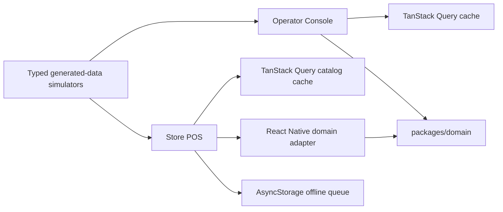
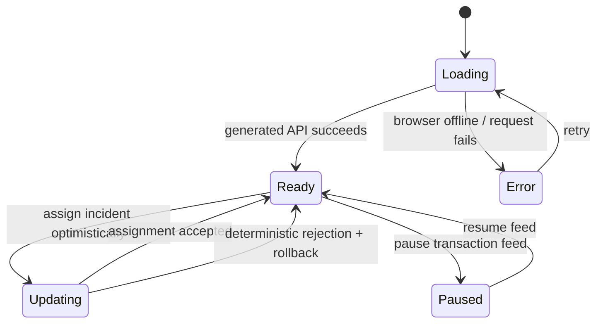
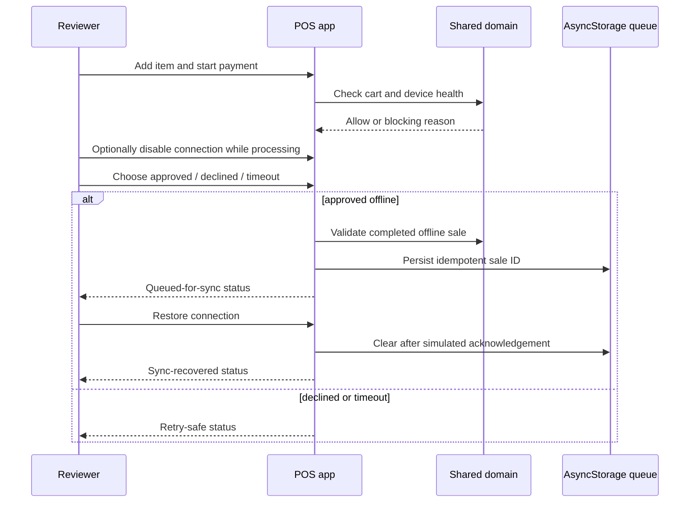

# Architecture

## Workspace boundaries

The npm workspace has three runtime boundaries:

| Boundary | Owns | Does not own |
| --- | --- | --- |
| `packages/domain` | Zod-validated money, cart, inventory, health, checkout, payment, queue, and fixture rules | React, network clients, browser/native APIs, persistence |
| `apps/operator-console` | MUI operations UI, TanStack Query/Table, typed browser simulator, live feed, optimistic workflow | Mobile UI or duplicated risk rules |
| `apps/store-pos` | Expo/React Native checkout UI, AsyncStorage queue, device-oriented accessibility, web export | Browser-console UI or core business rules |

Each app translates platform-friendly data into `packages/domain` inputs. The Operator Console imports inventory-risk rules directly. The POS uses `src/domain.ts` as a small adapter over shared cart, health, payment, and queue rules.

## Operator Console state flow

TanStack Query owns the dashboard snapshot. Filters, sorting, selected store, feed pause, generated transactions, and simulation mode are local UI state. The live mode is intentionally a deterministic timer simulation—not a claimed production WebSocket implementation.

The compact implementation keeps the query and feed in `App.tsx` so the demo is easy to inspect. The article on event reconciliation describes the sequence-aware cache bridge a larger production system should add; it does not claim that this simulator implements ordered server events.

## POS checkout and offline flow

A shared pure guard checks cart and store/device health before payment. The UI drives an explicit payment state machine. If connectivity is lost after payment starts and the deterministic outcome approves, the sale ID is persisted in AsyncStorage. Restoring the in-app connection simulates an acknowledgement and removes queued IDs.

## Deliberate demo boundaries

- All stores, products, incidents, and payments are generated; no external service or customer data is used.
- The Operator Console live feed uses a deterministic interval, not a socket.
- The POS sync acknowledgement is simulated. A production queue would persist full schema-versioned sale payloads, retry metadata, and server idempotency keys.
- No performance or production-scale claim is made. `docs/verification.md` explains how to collect scoped evidence.
