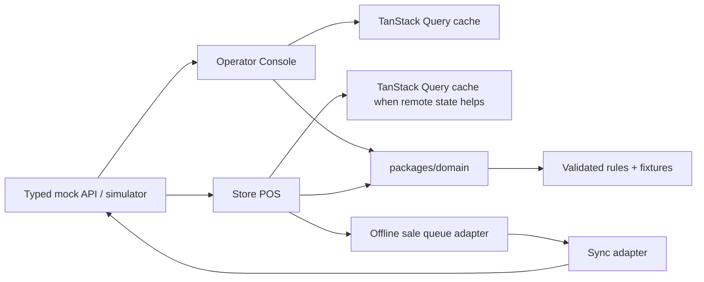
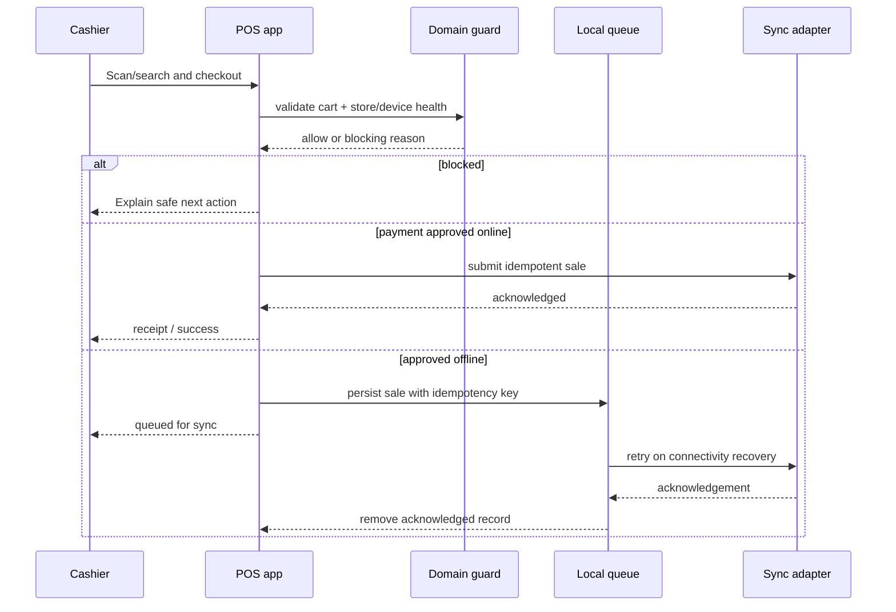

# Architecture

## Workspace boundaries

The repository is an npm workspace with three deliberately separate runtime boundaries:

| Boundary | Owns | Must not own |
| --- | --- | --- |
| `packages/domain` | Runtime-validated domain inputs, money/cart/inventory/store-health rules, checkout guards, event shapes, deterministic fixtures | React components, network clients, browser/native APIs, persistence |
| `apps/operator-console` | Browser operations UI: query cache, tables, simulation/event adapter, accessible desktop workflows | POS UI or duplicated domain rules |
| `apps/store-pos` | Expo/React Native checkout UI, local offline queue adapter, device-oriented accessibility, web export | Browser-console UI or duplicated domain rules |

Adapters at each app edge translate transport/persistence data into `packages/domain` inputs. Domain rules return data and typed outcomes; presentation and side effects stay in the app.

## Operator Console state flow

Server facts are owned by TanStack Query. Filters, sort, selected store, feed pause, and simulation mode are local UI state. Incoming events are normalized, validated, and applied to the cache only when their event sequence is newer than cached data. A stale clock is derived from `lastUpdatedAt`; it is not an independently mutable status.

```mermaid
stateDiagram-v2
  [*] --> Loading
  Loading --> Ready: initial query succeeds
  Loading --> Error: initial query fails
  Error --> Loading: retry
  Ready --> Stale: age exceeds freshness threshold
  Stale --> Ready: refresh/event accepted
  Ready --> Offline: browser reports offline
  Stale --> Offline: browser reports offline
  Offline --> Loading: connection restored + retry
  Ready --> Updating: optimistic incident assignment
  Updating --> Ready: mutation confirmed
  Updating --> Ready: failure; rollback + error notice
```

## POS checkout and offline flow

A checkout decision is made by a shared pure guard before payment. Completion while offline writes an idempotent sale record locally. Sync only removes an item after a confirmed acknowledgement; failures preserve it for retry and show the user a clear state.

## Contract rules

- Generated fixtures are deterministic: a seed and scenario name reproduce visible data and failures.
- Event payloads, API responses, and persisted queue records are runtime-validated before state changes.
- Query keys include the resource identity and active scenario; event handlers do not overwrite newer cache records.
- Optimistic mutations capture a rollback snapshot and expose failure/retry status accessibly.
- Offline queue entries include a schema version, created time, retry count, and idempotency key. Never treat a local write as a server acknowledgement.
